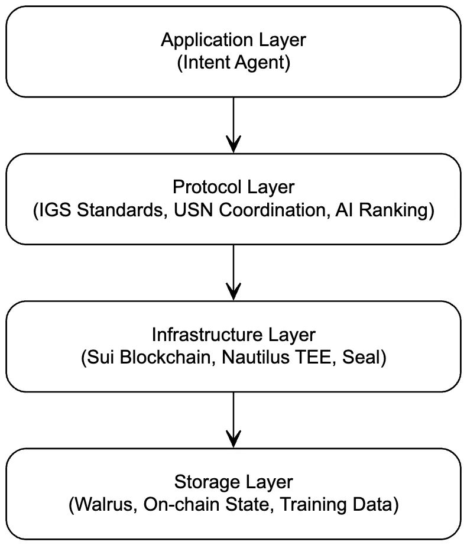

# System Architecture

## Overview

Intenus operates as a four-layer architecture combining on-chain and off-chain components:

<figure><figcaption></figcaption></figure>

## Component Interaction

### User Journey Flow

1. **Intent Submission**
   * User → Intent Agent (NLP processing)
   * Intent Agent → Smart Contracts (on-chain registration)
   * Smart Contracts → Walrus (data storage)
   * Smart Contracts → Seal (encryption setup)
2. **Solver Discovery**
   * Orchestrator → Seal (decrypt for qualified solvers)
   * Solvers → Smart Contracts (solution submission)
   * Solutions → Walrus (temporary storage)
3. **AI Ranking**
   * Orchestrator → Nautilus TEE (secure environment)
   * TEE retrieves encrypted solutions
   * AI models rank solutions
   * TEE generates attestation proof
4. **Execution**
   * Winning solution → Sui Blockchain (PTB execution)
   * Results → Smart Contracts (verification)
   * History → Walrus (archival)

### Key Technologies

#### Sui Blockchain

**Role**: Settlement layer and transaction execution

**Why Sui**:

* Programmable Transaction Blocks for atomic multi-step execution
* High throughput for competitive solver networks
* Low latency for time-sensitive trades
* Native object model for efficient state management

#### Nautilus TEE Framework

**Role**: Trusted execution environment for AI ranking

**Why Nautilus**:

* Hardware-based security guarantees
* Remote attestation capabilities
* Isolated computation environment
* Integration with Sui ecosystem

#### Walrus Decentralized Storage

**Role**: Off-chain data availability layer

**Why Walrus**:

* Cost-effective storage for large intent data
* Cryptographic proof of data integrity
* Distributed availability guarantees
* Efficient retrieval for AI training

#### Seal Programmable Access Control

**Role**: Encryption and privacy management

**Why Seal**:

* Fine-grained access control policies
* Time-bounded access mechanisms
* Key management integration
* Native Sui compatibility
